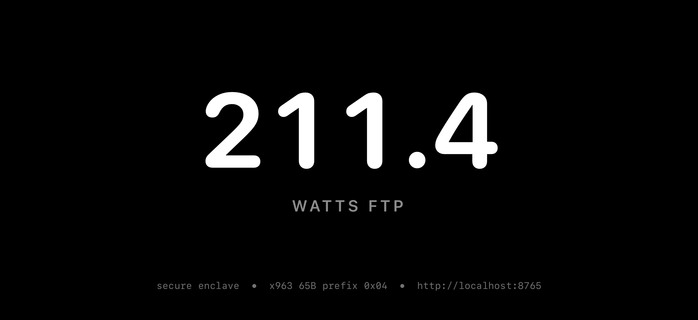

# The iOS walking skeleton

Issue #171, folding in the minimum of #158.

**This is not a working app.** It is one thread pulled through every layer of
the iOS epic exactly once, so that the layer most likely to be wrong is wrong
now rather than after four screens exist. Read what it skipped before building
on it.

## What it proved

**The byte-for-byte agreement between the Swift client and
`canonical_request`.** This was the point. The server signs over a
length-framed, domain-separated byte string, and a client that produces those
bytes even one byte differently gets a 401 with no diagnostic on either side.
Two things now check it:

- `tests/vectors/canonical_request_v1.json`, asserted by
  `tests/test_canonical_request_vectors.py` and by
  `ios/WatTracker/WatTrackerTests/CanonicalRequestVectorTests.swift`. One file,
  referenced from both, not copied — they cannot drift. Ten canonical-request
  cases, four body digests, two field-boundary pairs that would collide without
  length framing, a UTF-8 byte-length case, and P-256 signature vectors.
- A live run: a real signed refresh against a real server returned a real
  reader context, and the GET after it returned the rider's FTP.

**The Secure Enclave export format**, which was the open question left on #159.
CryptoKit's `publicKey.x963Representation` is 65 bytes with an `0x04` prefix —
uncompressed SEC1, exactly what `validate_public_key` accepts and nothing else.
The nearby `rawRepresentation` is the same point without the prefix and is
rejected, which is the mistake a client makes once.

`SecureEnclave.isAvailable` turned out to be **true** on the iOS 26.4 simulator
on Apple Silicon, so the live run signed with a real Enclave-backed key rather
than the fallback. That was not expected, and it means the fallback is for
Intel simulators and CI rather than for everyday development here.

**That ECDSA malleability is survivable in both directions.** The server
deliberately does not enforce low-s, because the Enclave emits high-s about
half the time. The shared vectors carry a signature and its malleable twin, and
CryptoKit verifies both — so neither side is quietly normalising, and if either
starts, a test says so instead of half of all refreshes failing in production.

**That the whole path works end to end**: a `profile` object built from the
rider's real database, pushed through the real signed sync route, a pairing
code minted by a writer-signed request, redeemed by the phone, traded for a
reader context by a device-signed refresh, and read back. The number on the
screen is the number in `ftp_history`.

## What it deliberately skipped

Nothing below is an oversight. Each is a decision to keep the skeleton thin.

- **One object kind, one field.** `profile` carries `ftp_watts` and nothing
  else. Issue #154 owns the object model; a richer profile invented here would
  collide with it. No weight, no zones, no provenance, no history.
- **No estimator.** The published FTP is the rider's override, else the newest
  `ftp_history` row. `current_ftp`'s third step — a detraining-decayed estimate
  — needs `init_db()` and a write connection, and an estimate is not a fact
  worth sending to another device as though it were one. A rider with neither
  publishes no profile at all rather than a default that looks like a
  measurement.
- **No persistence of the device credential.** The signing key survives
  relaunch in the keychain; the credential it was paired into does not. Every
  launch pairs again with a fresh code. Storing credentials is #160's job.
- **No token refresh loop.** A reader context lasts 300 seconds and the app
  refreshes exactly once, at pairing. There is no expiry handling, no retry,
  and no error recovery beyond printing what went wrong.
- **No cache and no offline handling.** No screen renders without a server.
- **No other screens.** No tab bar, no sidebar, no navigation, no charts. The
  five destinations #158 describes are not stubbed here; the shell is a
  separate piece of work and this slice had no use for it. *(#158 has since
  built that shell around this screen, which is now reached from Settings as
  "Debug: FTP round-trip".)*
- **No styling pass.** Black background, white number, legible. That is the
  whole design.
- **No desktop integration.** `scripts/walking_skeleton_server.py` is a
  development harness. Nothing in the desktop app publishes a profile or mints
  a pairing code on its own yet, and no UI anywhere shows a pairing code to the
  rider.
- **No deployment.** The run was against a loopback server with an in-memory
  store, no APIM, and therefore no gateway-attested subject. The subject-binding
  paths through pairing and refresh are exercised by the Python suite, not by
  this run.

## What it found that the issues did not say

- **iPadOS 26 no longer honours a landscape-only orientation list.** Measured:
  with `UISupportedInterfaceOrientations~ipad`, `UIRequiresFullScreen`, and a
  runtime `requestGeometryUpdate(.iOS(interfaceOrientations: .landscape))` all
  in place, the app still lays out portrait on a portrait iPad simulator
  running iPadOS 26.4 — `docs/images/171-ipad-framebuffer.png` is that run, the
  same FTP rendered in a portrait window. iPhone is unaffected and enforces
  landscape. #158's "landscape only on both idioms" needed a decision: either
  every iPad layout survives a portrait window, or the app stops building
  against the iOS 26 SDK.

  **Decided in #158: the iPad adapts.** It declares all four orientations,
  `UIRequiresFullScreen` is gone, and every iPad layout must be correct in
  portrait — not necessarily optimal, but never broken. Dropping to an older
  SDK was rejected because #166 ships this to TestFlight and App Store
  submission requires a current SDK, which would trade a layout problem for a
  distribution blocker. iPhone stays landscape-locked, so the two idioms now
  declare different orientation sets on purpose. See `ios/README.md`.
- **`simctl io screenshot` always writes the display's native framebuffer.**
  A landscape app on a portrait iPhone captures as a portrait image with the
  content rotated. `docs/images/171-iphone-framebuffer.png` is the untouched
  capture; `docs/images/171-iphone-landscape.png` is the same file rotated 270
  degrees so it can be read. Nothing else was done to either.
